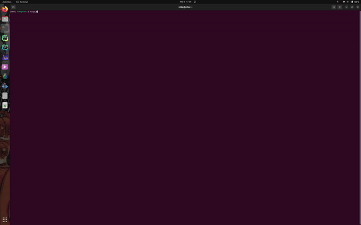
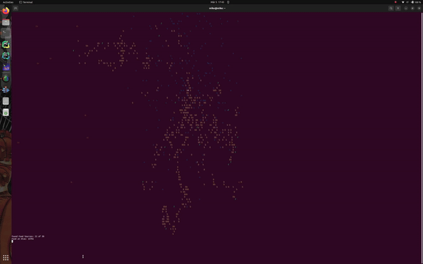

# NinjaBees


Simulation of a bee colony.

Bees try to discover all food sources in the simulated world.

Bee Colony Optimization Algorithm as Core Algorithm:
- Employed Bee Phase
- Onlooker Bee Phase

Natural Behavior of Bees:
- Scout Bee remembers path to food
- Forager Bee uses one of all known path to get food
- If Scout Bee finds a shorter path, update path to food
- Information is only shared inside the Hive


# Demo

## Initial Phase of the Bee Colony



## Bee Colony after a few iterations



# Usage

```bash
usage: ninja_bees [-h] [--version] [--world-width WORLD_WIDTH] [--world-height WORLD_HEIGHT] [--number-bees NUMBER_BEES] [--max-cnt-foraging-bees MAX_CNT_FORAGING_BEES] [--number-food-sources NUMBER_FOOD_SOURCES] [--best-nutrition-score BEST_NUTRITION_SCORE]

Simulation of a bee colony using the bee colony optimization algorithm.

options:
  -h, --help            show this help message and exit
  --version             show program's version number and exit
  --world-width WORLD_WIDTH
                        Width of the environment.
  --world-height WORLD_HEIGHT
                        Height of the environment.
  --number-bees NUMBER_BEES
                        Number of bees in the environment.
  --max-cnt-foraging-bees MAX_CNT_FORAGING_BEES
                        The maximum count of foraging bees.
  --number-food-sources NUMBER_FOOD_SOURCES
                        Number of food sources in the environment.
  --best-nutrition-score BEST_NUTRITION_SCORE
                        The best nutrition score in the environment.

```