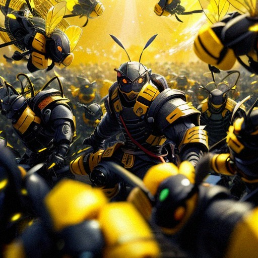

# NinjaBees



An implementation of a simulation of a bee colony.

# Usage

```bash
usage: ninja_bees [-h] [--version]

Simulation of a bee colony using the bee colony optimization algorithm.

options:
  -h, --help  show this help message and exit
  --version   show program's version number and exit
```